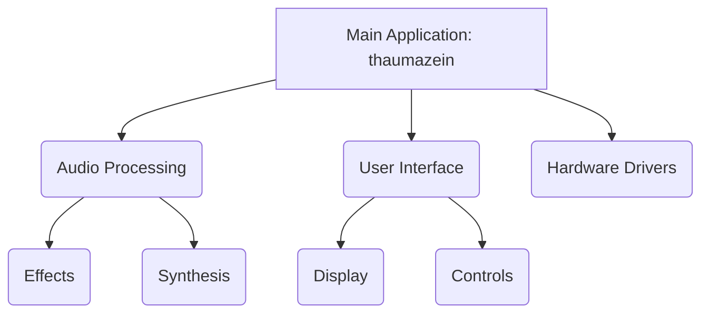

# Thaumazein Project Overview

Thaumazein is a project focused on [Please describe your project here].

## Current Tasks

*   [ ] Resolve QSPI boot issues.
    *   [x] Ensure `APP_TYPE = BOOT_QSPI` is in Makefile.
    *   [x] Ensure `C_DEFS += -DBOOT_APP` is in Makefile.
    *   [ ] Verify linker script and QSPI address.
*   [ ] [Add other tasks here]

## Codebase Diagram

*(This is a basic diagram, it will be updated as the codebase evolves)*
