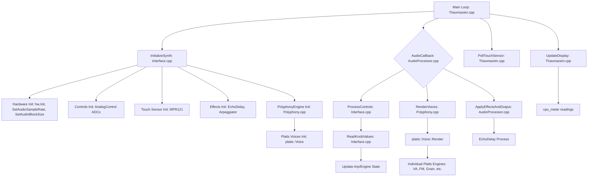

# Thaumazein Project Overview

Thaumazein is a polyphonic Eurorack voice built on the Daisy Seed.  It combines Plaits-style macro-oscillators, per-voice envelopes, an arpeggiator, and a small effects chain (delay, biquad filters, and freeverb) into a self-contained synth engine.

# Firmware build targets

* **`make flash-stub`** – build a tiny internal-flash stub that sets up QSPI XIP then jumps to the main app.
* **`make flash-app`** – build the full application for execution-in-place at `0x90040000` and flash it with DFU.
* **`make program-dfu`** – same as **flash-app** when `APP_TYPE=BOOT_QSPI` (default).

The binary produced under `build/` should begin with:

```
0x0000 0220  <-- MSP = 0x20020000 (top of DTCM)
0x9106 0490  <-- Reset _Handler = 0x90040691 (QSPI)
```

If either of these words looks wrong the bootloader will stay in DFU.

## Project Overview and Tasks

### Description
Thaumazein is a polyphonic synthesizer running on the Daisy Seed platform, featuring multiple synthesis engines from Mutable Instruments Plaits, along with effects like delay and arpeggiation. It uses a touch-based interface for control.

### Current Tasks
*   Integrate Clouds granular texture synthesizer.
*   Optimize CPU usage further if needed.
*   Refine UI/UX for engine and parameter control.
*   Investigate and resolve any remaining audio artifacts at different sample rates/block sizes.

### Codebase Diagram


## Changing Sample Rate

To change the audio sample rate of the project, the following modifications are necessary:

1.  **Daisy Hardware Initialization (`Interface.cpp`)**:
    *   In `InitializeHardware()`, set the desired sample rate using `hw.SetAudioSampleRate()`. For example, for 32kHz:
        ```cpp
        hw.SetAudioSampleRate(SaiHandle::Config::SampleRate::SAI_32KHZ);
        ```
    *   Ensure the `sample_rate` variable is updated from `hw.AudioSampleRate()` after this call.
    *   Update `cpu_meter.Init(sample_rate, BLOCK_SIZE);` with the new `sample_rate`.
    *   Update `delay.Init(sample_rate);` in `InitializeDelay()` with the new `sample_rate`.
    *   Update `arp.Init(sample_rate);` in `InitializeSynth()` (and wherever else it's re-initialized, like in `UpdateArpeggiatorToggle`) with the new `sample_rate`.

2.  **Plaits DSP Code (`eurorack/plaits/dsp/dsp.h`)**:
    *   Modify the `kSampleRate` constant to match the new hardware sample rate. For 32kHz:
        ```cpp
        static const float kSampleRate = 32000.0f;
        ```

3.  **Plaits DSP Block Size Constants (`eurorack/plaits/dsp/dsp.h`)**:
    *   The constant `kMaxBlockSize` defines the internal buffer sizes for Plaits' `Voice` rendering. This **must** be set to be equal to or greater than the `BLOCK_SIZE` used by the Daisy audio callback (defined in `Polyphony.h`). For example, if Daisy's `BLOCK_SIZE` is 32:
        ```cpp
        const size_t kMaxBlockSize = 32;
        ```
    *   Note: `kBlockSize` within `dsp.h` (e.g., `const size_t kBlockSize = 12;`) is a separate Plaits-internal constant used for some fixed calculations and might not need to change, but its usage in envelope calculations needs to be adjusted (see next point).

4.  **Plaits Voice Envelope Timing (`eurorack/plaits/dsp/voice.cc`)**:
    *   In `Voice::Render()`, several internal calculations for envelope rates (attack, decay) use Plaits' original `kBlockSize` (e.g., 12). These calculations must be updated to use the actual block `size` being passed into the `Render` function by the Daisy audio callback.
    *   Specifically, update the following lines:
        *   `short_decay` calculation:
            ```cpp
            // OLD: const float short_decay = (200.0f * kBlockSize) / kSampleRate * SemitonesToRatio(-96.0f * patch.decay);
            const float short_decay = (200.0f * size) / kSampleRate * SemitonesToRatio(-96.0f * patch.decay); // Use actual block 'size'
            ```
        *   `decay_tail` calculation for LPG:
            ```cpp
            // OLD: const float decay_tail = (20.0f * kBlockSize) / kSampleRate * SemitonesToRatio(-72.0f * patch.decay + 12.0f * hf) - short_decay;
            const float decay_tail = (20.0f * size) / kSampleRate * SemitonesToRatio(-72.0f * patch.decay + 12.0f * hf) - short_decay; // Use actual block 'size'
            ```
        *   `attack` calculation for LPG ping:
            ```cpp
            // OLD: const float attack = NoteToFrequency(p.note) * float(kBlockSize) * 2.0f;
            const float attack = NoteToFrequency(p.note) * float(size) * 2.0f; // Use actual block 'size'
            ```

5.  **Project `SAMPLE_RATE` Macro (`Thaumazein.h`)**:
    *   Ensure the global `SAMPLE_RATE` macro (if used by other parts of your code, like `Polyphony.cpp`) correctly reflects the new sample rate. It's best to have this macro use the runtime `sample_rate` variable:
        ```cpp
        // extern float sample_rate; // Declaration of the runtime variable
        #define SAMPLE_RATE sample_rate // Macro uses the runtime variable
        ```

6.  **Voice Parameter Initialization (`Polyphony.cpp`)**:
    *   In `PolyphonyEngine::InitVoiceParameters()`, ensure that `voice_envelopes_[i].Init()` is called with the correct runtime `sample_rate_val` derived from the hardware.
        ```cpp
        // float sample_rate_val = SAMPLE_RATE; // This would use the macro from Thaumazein.h
        float sample_rate_val = hw_ptr_->AudioSampleRate(); // Or pass sample_rate directly
        // ...
        voice_envelopes_[i].Init(sample_rate_val);
        ```

After making these changes, a full `make clean && make program-dfu` is required.

## Licensing

This project utilizes code from Mutable Instruments, which is licensed under the MIT License. A copy of the MIT License is provided below:

```text
Copyright (c) <YEAR> <COPYRIGHT HOLDER> // To be replaced with actual MI copyright details

Permission is hereby granted, free of charge, to any person obtaining a copy
of this software and associated documentation files (the "Software"), to deal
in the Software without restriction, including without limitation the rights
to use, copy, modify, merge, publish, distribute, sublicense, and/or sell
copies of the Software, and to permit persons to whom the Software is
furnished to do so, subject to the following conditions:

The above copyright notice and this permission notice shall be included in all
copies or substantial portions of the Software.

THE SOFTWARE IS PROVIDED "AS IS", WITHOUT WARRANTY OF ANY KIND, EXPRESS OR
IMPLIED, INCLUDING BUT NOT LIMITED TO THE WARRANTIES OF MERCHANTABILITY,
FITNESS FOR A PARTICULAR PURPOSE AND NONINFRINGEMENT. IN NO EVENT SHALL THE
AUTHORS OR COPYRIGHT HOLDERS BE LIABLE FOR ANY CLAIM, DAMAGES OR OTHER
LIABILITY, WHETHER IN AN ACTION OF CONTRACT, TORT OR OTHERWISE, ARISING FROM,
OUT OF OR IN CONNECTION WITH THE SOFTWARE OR THE USE OR OTHER DEALINGS IN THE
SOFTWARE.
```

Additionally, the DaisySP library is used, which is also under the MIT license. Other components may have their own licenses; please refer to individual source files or library documentation for specific licensing information.